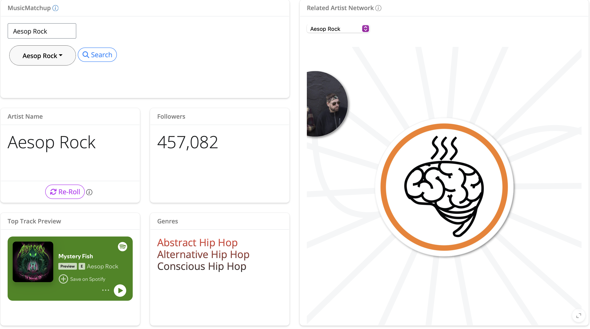
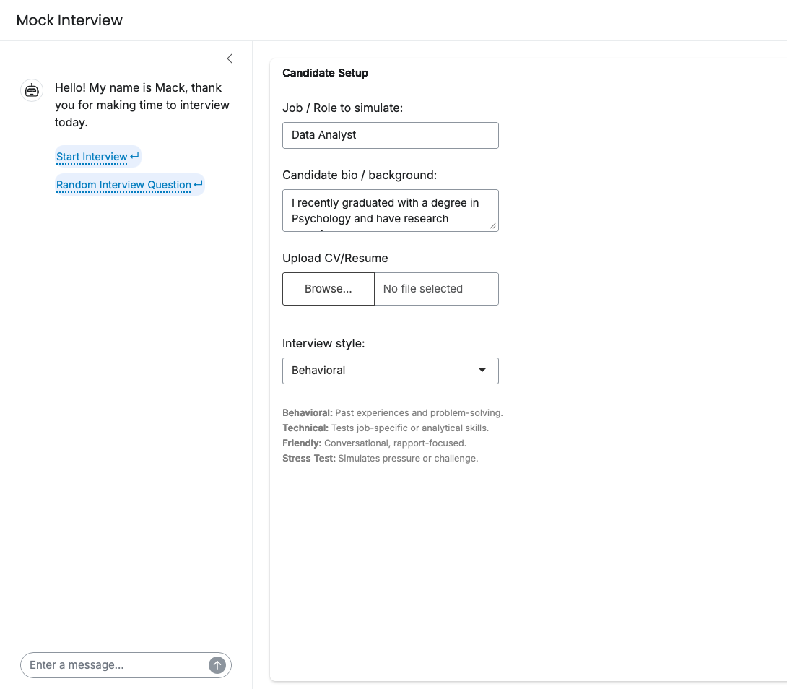

A few Shiny apps and R packages I've built for teaching and fun.

<a href="https://dbrocker.shinyapps.io/MusicMatchup/" class="stretched-link">MusicMatchup</a>

Discover your next favorite artist through interactive data visualizations powered by the Spotify API.

Launch app →

<a href="https://dbrocker.shinyapps.io/MockInterview/" class="stretched-link">Mock Interview</a>

Prepare for graduate school and post-graduate employment. Built using Shiny and the OpenAI API.

Launch app →

## Packages I've built

CRAN

<a href="https://cran.r-project.org/package=aesopR" class="stretched-link">aesopR</a>

A tidy, public-domain corpus of 147 Aesop's Fables — full texts, word-level tokens, and pre-joined sentiment lexicons — built for text analysis and NLP teaching without relying on copyrighted material.

View on CRAN →

GitHub

<a href="https://github.com/DavidBrocker/musickitr" class="stretched-link">musickitr</a>

Tidy, tibble-based access to the Apple Music Catalog API — search, charts, and Jaccard similarity utilities for building recommendation tools, in the spirit of spotifyr.

View on GitHub →

