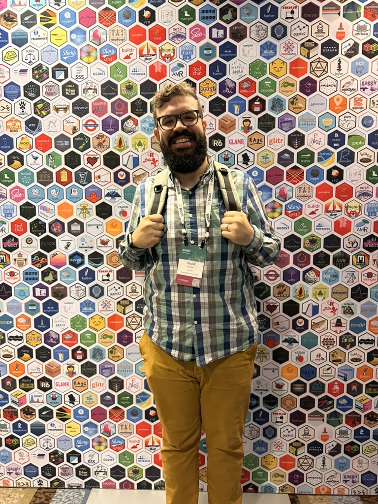
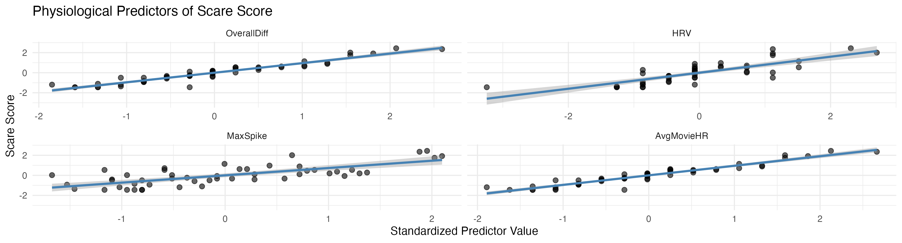
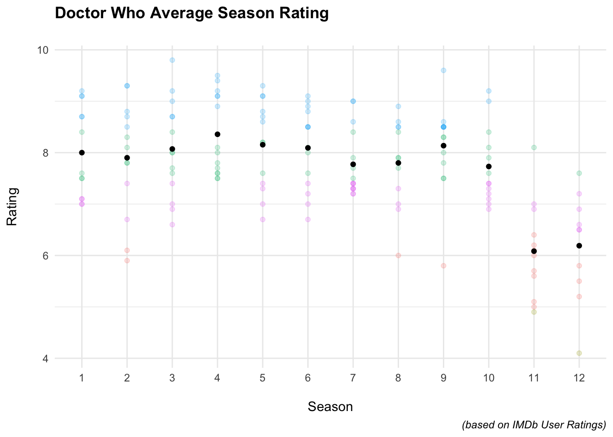
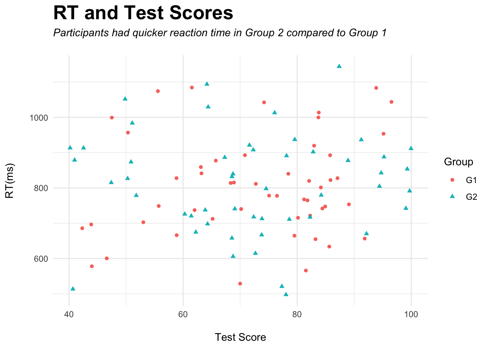
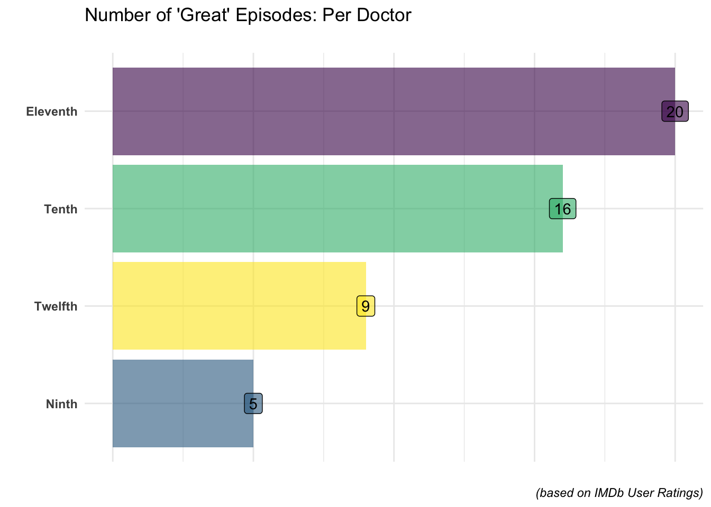

Hi, I'm Dave

I <a href="courses.qmd">teach</a> statistics, research methods, and professional development. I <a href="writing.qmd">write</a> and speak about R in both academic and professional settings (or <em>anywhere</em> that lets me!) I make <a href="apps.qmd">Shiny</a> apps for teaching and fun.

After dark, I study why we can't look away — morbid curiosity, taboo, and the things that go bump in the night.

<a href="courses.qmd" class="pill-btn btn-plum">Browse my courses</a>
<a href="portfolio.qmd" class="pill-btn btn-ghost-plum">See my work →</a>

Currently teaching

Statistics for PsychologyInstructor

Research MethodsInstructor

Senior Project I/IIInstructor

Research Design &amp; Analysis IInstructor

Experimental PsychologyLab Instructor

<a href="courses.qmd" class="btn-ghost-plum" style="display:inline-block;margin-top:0.5rem;">See all 8 courses →</a>

Writing

<a href="writing.qmd" class="stretched-link">Using ShinyDashboard for a Music Recommendation Tree</a>

Medium · October 2022

<a href="apps.qmd" class="stretched-link">Apps &amp; packages</a>

 MusicMatchup

 Mock Interview

 aesopR (CRAN)

All apps &amp; packages →

<a href="portfolio.qmd" class="stretched-link">Portfolio</a>

See the gallery →

::: {.kurbits-divider}
:::

:::::: icon-container
::: icons

:::

::: icons

:::

::: icons

:::
::::::
