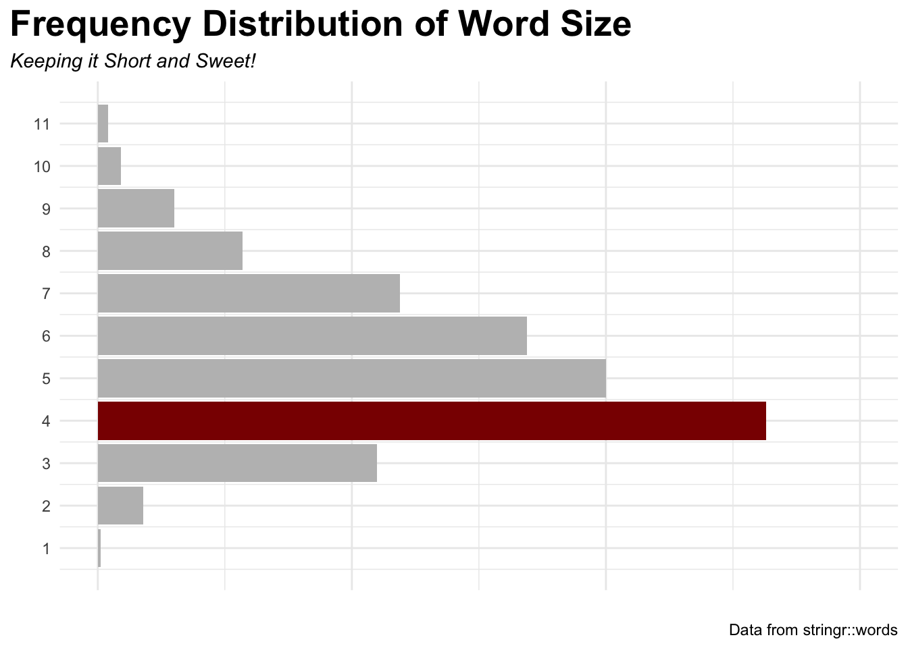

A few examples of analysis and visualization work.

Physiological Predictors of Scare Score

Multivariate regression identifying which physiological signals best predict a subjective "scare" response during horror films (R² = 0.999).

Season-Over-Season Rating Trends

Per-season average ratings layered over individual episode scores across 12 seasons of a long-running series.

Reaction Time vs. Test Performance

Group comparison exploring the relationship between reaction time and test score across two experimental conditions.

Standout-Episode Comparison

Categorical breakdown comparing top-rated episode counts across leads.

Word-Length Distribution

Text analytics on a 980-word corpus, surfacing the most common word length.

