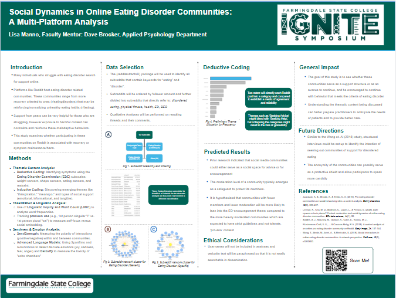
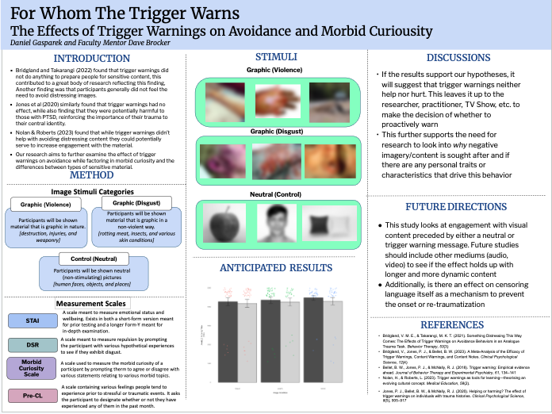
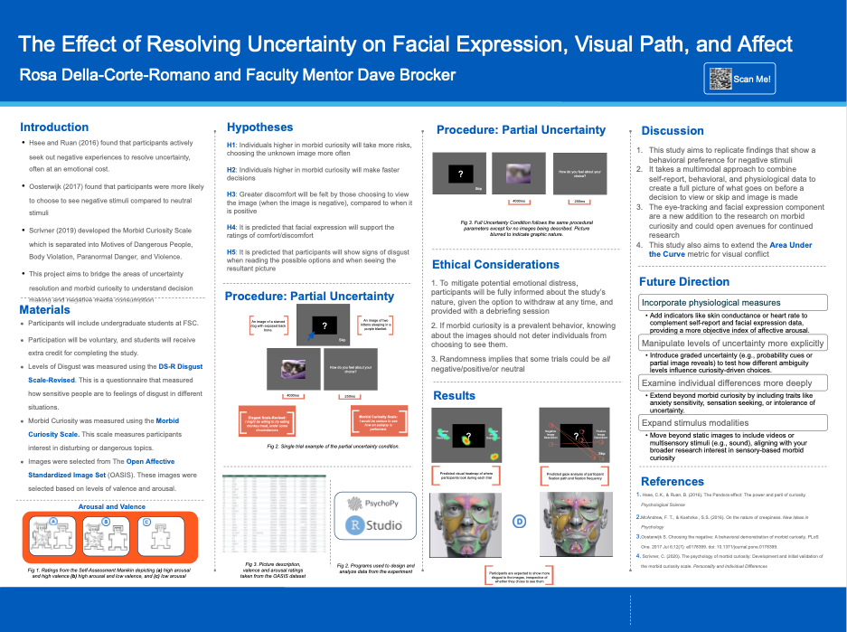
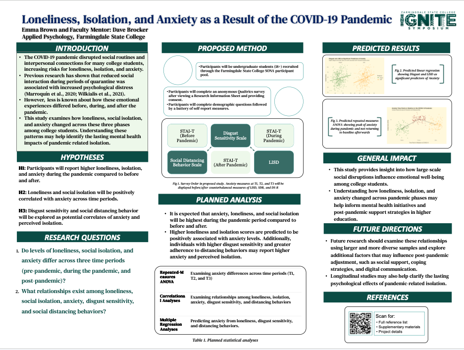
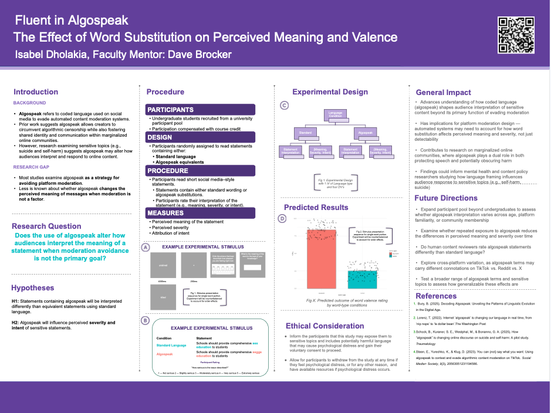
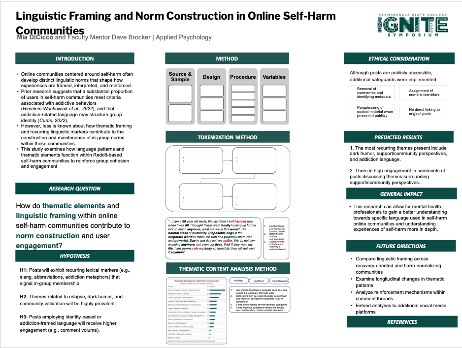

My research lives in Social Psychology, focused on Person Perception — I design studies to explore why people do weird things (like seek out horror, or look away from it) and how we perceive and respond to one another.

## Projects

With Brendan Jaghab

<a href="https://davidbrocker.github.io/Morbid/" class="stretched-link">Morbid Curiosity, Anxiety &amp; VANE</a>

Whether morbid curiosity predicts a taste for horror, correlates with anxiety, and drives people to seek out negative stimuli — part of IGNITE Symposium Vol. 4.

View full report →

With Maria Anderson

<a href="https://davidbrocker.github.io/BOC/" class="stretched-link">Burden of Care: Informal Caregiver Attitudes &amp; Wellbeing</a>

How confidence, social support, and priming relate to caregiver burden and the positive aspects of caregiving.

View full report →

## Student Posters

### IGNITE Symposium Vol. 4

Undergraduate research supervised as part of the IGNITE Symposium.

<a href="https://davidbrocker.github.io/Morbid/eating_disorder.html" class="stretched-link">Social Dynamics in Online Eating Disorder Communities</a>

<a href="https://davidbrocker.github.io/Morbid/trigger.html" class="stretched-link">For Whom the Trigger Warns: Trigger Warnings, Avoidance &amp; Morbid Curiosity</a>

<a href="https://davidbrocker.github.io/Morbid/resolving_uncertainty.html" class="stretched-link">Resolving Uncertainty: Facial Expression, Visual Path &amp; Affect</a>

<a href="https://davidbrocker.github.io/Morbid/lisd.html" class="stretched-link">Loneliness, Isolation &amp; Anxiety During COVID-19</a>

<a href="https://davidbrocker.github.io/Morbid/algospeak.html" class="stretched-link">Word Substitution &amp; Perceived Meaning and Valence</a>

<a href="https://davidbrocker.github.io/Morbid/self_harm.html" class="stretched-link">Linguistic Framing in Online Self-Harm Communities</a>

