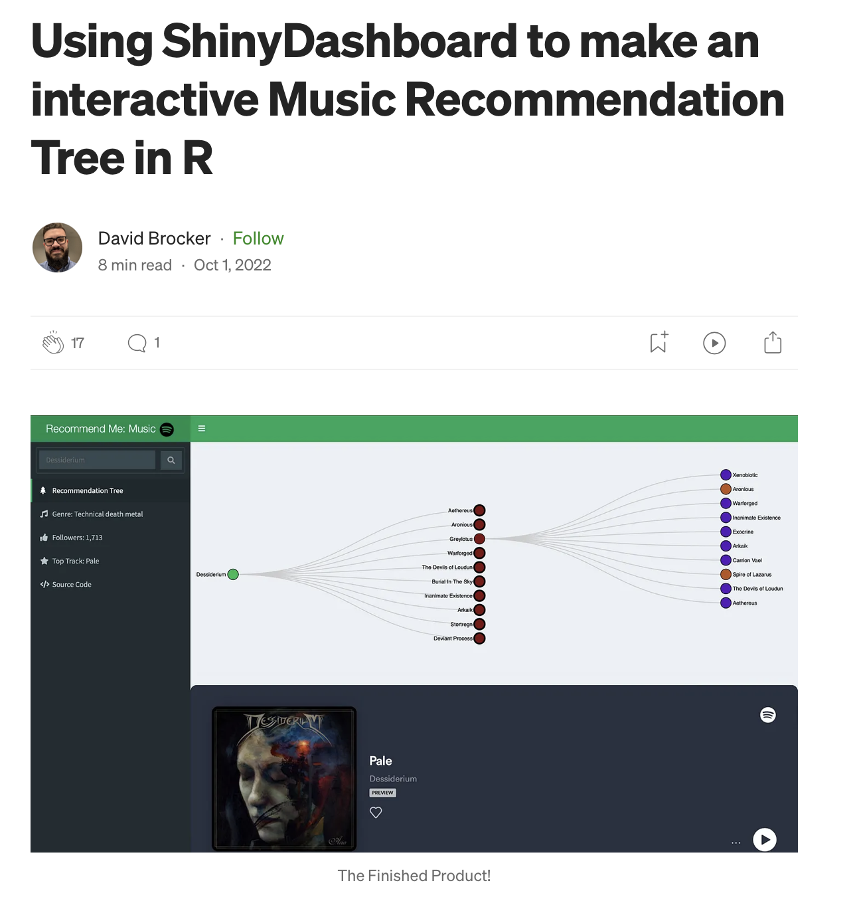

## Writing

Below are selected tutorials and articles I’ve published on *Medium*, focused on R, data visualization, and Shiny app development.

::: {.kurbits-divider}
:::

:::: writing-grid

::: writing-card

{.writing-image}
**[Using ShinyDashboard to make an interactive Music Recommendation Tree in R](https://medium.com/@davidbrocker/using-shinydashboard-to-make-an-interactive-music-recommendation-tree-in-r-...)**  
Published on Medium · October 2022  
Explore how to build a dynamic recommendation dashboard in R using `shinydashboard`, `visNetwork`, and the Spotify API.
:::

::::

